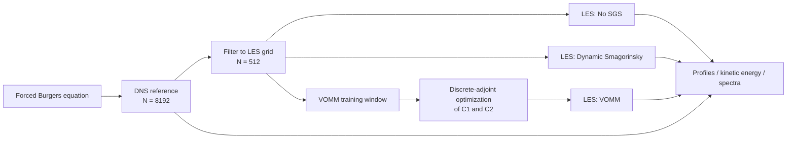
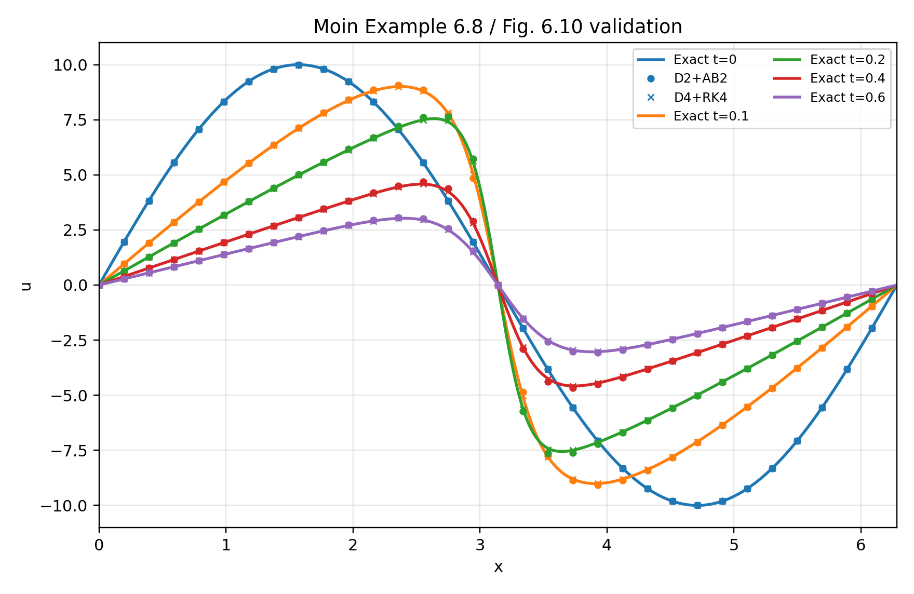
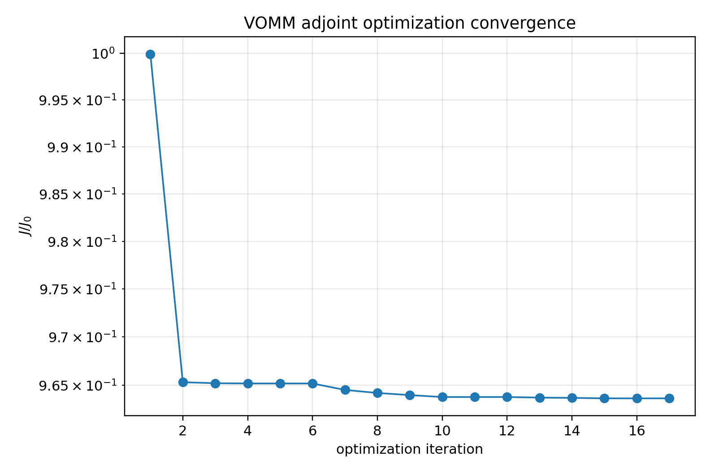
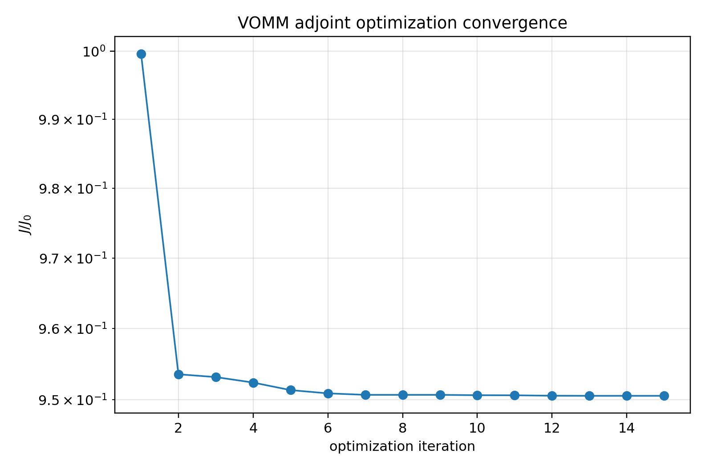

# Large-Eddy Simulation of the Forced Burgers Equation with Adjoint-Based SGS Modeling

A reproducible Python framework for **DNS/LES of the one-dimensional forced stochastic Burgers equation**, with a focus on subgrid-scale (SGS) modeling, conservative discretization, and adjoint-based coefficient optimization.

The repository compares three LES closures:

- **No SGS model**
- **Dynamic Smagorinsky Model (DSM)**
- **Variational Optimal Mixed Model (VOMM)** with coefficients calibrated using a verified discrete-adjoint workflow

Two numerical pipelines are provided:

- **D2 + AB2:** second-order conservative spatial discretization with Adams-Bashforth time integration
- **D4 + RK4:** fourth-order conservative spatial discretization with classical Runge-Kutta time integration

## Highlights

- Entropy-conservative finite-difference treatment of the Burgers nonlinear term
- DNS reference configuration with an LES-filtered training window
- Dynamic Smagorinsky SGS closure
- Adjoint-based VOMM calibration with bound-constrained optimization
- Discrete VJP/adjoint consistency and finite-difference gradient verification
- Checkpoint/restart support for long production runs
- Post-processing for velocity profiles, resolved kinetic energy, stationary spectra, DSM coefficients, and validation plots
- Automated numerical verification through GitHub Actions

## Numerical workflow



## Verification

The built-in self-test checks spatial accuracy, discrete conservation, nonlinear VJP consistency, spectrum-gradient differentiation, and VOMM Jacobian-transpose consistency.

Observed convergence from the current implementation:

| Operator | Observed asymptotic rate |
|---|---:|
| Entropy-conservative D2 nonlinear derivative | 2.00 |
| Entropy-conservative D4 nonlinear derivative | 3.99 |

Additional checks achieve near-machine-precision agreement between paired formulations, including the spectrum finite-difference gradient and VOMM dot-product test.

Run the full numerical verification with:

```bash
python src/burgers_les.py self-test
```

## Validation example

A lightweight periodic viscous-Burgers validation case is included for both numerical pipelines. The example can be reproduced without the large DNS/LES production datasets:

```bash
bash scripts/run_validation.sh
```



## VOMM optimization

The repository includes the full multi-stage bound-expansion histories used to obtain the production VOMM coefficients.

| Scheme | C1 | C2 | Overall objective reduction | Final gradient-check relative error |
|---|---:|---:|---:|---:|
| D2 + AB2 | 0.5640913195 | 0.0760436597 | 3.64% | 1.08e-7 |
| D4 + RK4 | 0.3792895859 | -0.0589446175 | 4.94% | 8.87e-8 |

### D2 + AB2 optimization



### D4 + RK4 optimization



## Repository structure

```text
.
├── src/
│   ├── burgers_les.py          # Solver, SGS models, adjoint workflow, diagnostics, self-tests
│   └── postprocess.py          # Validation and LES post-processing
├── configs/
│   ├── dns/                    # Production DNS reference configuration
│   ├── les/                    # D2+AB2 and D4+RK4 LES configurations
│   ├── training/               # Multi-stage VOMM training configurations
│   └── validation/             # Lightweight validation cases
├── results/
│   └── vomm/                   # Curated final optimization histories
├── assets/                     # Small tracked figures used in this README
├── scripts/
│   ├── run_validation.sh
│   └── run_full_workflow.sh
├── .github/workflows/ci.yml    # Automated numerical self-test
├── CITATION.cff
├── GITHUB_SETUP.md             # Suggested repository description, topics, and publishing checklist
├── requirements.txt
└── README.md
```

## Installation

Python **3.10+** is recommended.

```bash
python -m venv .venv
source .venv/bin/activate       # Windows: .venv\Scripts\activate
python -m pip install --upgrade pip
python -m pip install -r requirements.txt
```

## Reproducing the production cases

### 1. DNS reference

```bash
python src/burgers_les.py simulate --config configs/dns/reference_d4_rk4.json
```

This run produces both the DNS output and the filtered LES-resolution reference window required for VOMM calibration.

### 2. Optional VOMM retraining

```bash
python src/burgers_les.py train-vomm --config configs/training/d2_ab2/stage1_bound035.json
python src/burgers_les.py train-vomm --config configs/training/d2_ab2/stage2_bound050.json
python src/burgers_les.py train-vomm --config configs/training/d2_ab2/stage3_bound070.json

python src/burgers_les.py train-vomm --config configs/training/d4_rk4/stage1_bound035.json
python src/burgers_les.py train-vomm --config configs/training/d4_rk4/stage2_bound050.json
```

The repository already contains the curated multi-stage optimization histories in `results/vomm/`, so retraining is only necessary when reproducing the calibration from scratch.

### 3. LES comparison — D2 + AB2

```bash
python src/burgers_les.py simulate --config configs/les/d2_ab2/no_model.json
python src/burgers_les.py simulate --config configs/les/d2_ab2/dsm.json
python src/burgers_les.py simulate --config configs/les/d2_ab2/vomm.json
```

### 4. LES comparison — D4 + RK4

```bash
python src/burgers_les.py simulate --config configs/les/d4_rk4/no_model.json
python src/burgers_les.py simulate --config configs/les/d4_rk4/dsm.json
python src/burgers_les.py simulate --config configs/les/d4_rk4/vomm.json
```

## Production configuration

The primary production simulations use:

| Parameter | Value |
|---|---:|
| DNS grid | 8192 points |
| LES grid | 512 points |
| Time step | 1.0e-4 |
| Final time | 200 |
| Stationary statistics window | 100 <= t <= 200 |
| Artificial numerical stabilization | None |

## Post-processing

Example D4+RK4 comparison after the production runs:

```bash
python src/postprocess.py profile \
  --dns outputs/dns/dns_n8192_d4_rk4_t200.npz \
  --les outputs/les/les_n512_no_model_d4_rk4_t200.npz \
        outputs/les/les_n512_dsm_d4_rk4_t200.npz \
        outputs/les/les_n512_vomm_d4_rk4_t200.npz \
  --outdir outputs/figures

python src/postprocess.py kinetic \
  --dns outputs/dns/dns_n8192_d4_rk4_t200.npz \
  --les outputs/les/les_n512_no_model_d4_rk4_t200.npz \
        outputs/les/les_n512_dsm_d4_rk4_t200.npz \
        outputs/les/les_n512_vomm_d4_rk4_t200.npz \
  --outdir outputs/figures

python src/postprocess.py spectrum \
  --dns outputs/dns/dns_n8192_d4_rk4_t200.npz \
  --les outputs/les/les_n512_no_model_d4_rk4_t200.npz \
        outputs/les/les_n512_dsm_d4_rk4_t200.npz \
        outputs/les/les_n512_vomm_d4_rk4_t200.npz \
  --outdir outputs/figures --tmin 100 --tmax 200
```

## Data policy

Large DNS/LES arrays, checkpoints, and generated production figures are intentionally excluded from version control. They can be regenerated from the tracked source code and JSON configurations. This keeps the repository lightweight while preserving the complete numerical workflow.

## Author

**Ali Parkan**  
**Email:** aliparkan@aut.ac.ir
